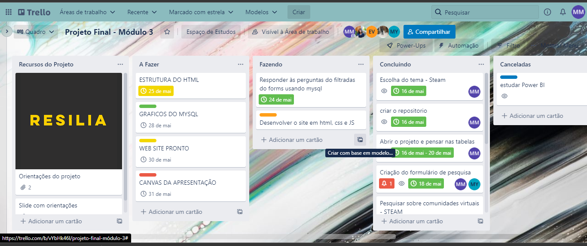

<h1 align="center">  PROJETO DE ENCERRAMENTO DO MÓDULO 3:
  
VISUALIZAÇÃO DE DADOS</h1>

<h2 align="center"> De que adiantam os dados se não podemos vê-los? <h2>

    <h3 style="font-size: 50px">Sub-Tema</h3>
    
Jogos e Seus impactos Econômicos

  
## 🔖 Descrição 

- Projeto teve como objetivo a manipulação de um bando de dados, o software utilizado para gerenciamento dos dados foi o MySQL, a partir das informações fornecidas no banco de dados, as perguntas foram elaboradas, os resultados foram apresentados por meio de gráficos.
- Objetivo do trabalho é aplicar os conceitos vistos ao longo do módulo de Dados e iniciarmos uma jornada sobre visualização de dados. A criação de dashboards é algo importante para que o time de Dados consiga transmitir o conhecimento gerado para outras áreas e para facilitar a visualização dos dados. Criamos perguntas que agregam valor.

 ## 📋 Querys/Perguntas
  
 <h2 style="font-size: 30px">Steam_Database</h2>
 
 https://drive.google.com/drive/folders/16mAGr-qUw6D3crOmOKR9AvgYOzKoHGhu

  
<ol style="line-height:370%">
  <li style="font-size: 20px">Anos com mais lançamentos de jogos ?</li>
 
  <li style="font-size: 20px">Quais os jogos mais caros da plantaforma?</li>
 
  <li style="font-size: 20px">Jogos mais bem avaliados da plantaforma?</li>
   
  <li style="font-size: 20px">Jogos mais bem avaliados lançados em 2013?</li>
 
  <li style="font-size: 20px">Jogos grátis com mais avaliações negativas?</li>
 
  <li style="font-size: 20px">jogos baratos, com a maior media por tempo jogado?</li>
 
  <li style="font-size: 20px">Desenvolvedoras com o maior numero de jogos na plantaforma?</li>
 
  <li style="font-size: 20px">Editoras com o maior numero de jogos publicados na plantaforma?</li>
 
   <li style="font-size: 20px">Jogos que rodam com no minimo 500mhz de processor?</li>
 
  <li style="font-size: 20px">Jogos +18 ?</li>
 
</ol>
  
## 📑 Entidades/driagram
  

## ✔️ Técnicas e tecnologias utilizadas

- ``HTML``
- ``CSS``
- ``JavaScript``
- ``Google Chart``
- ``MYSQL``

## 📝 Metodologias ágeis
- ``KANBAN``

## ✨ Contribuidores 

<table align="center">
  <tr>
<td align="center"><a href="https://github.com/k-js"> <b>k-js</b></a> <a href="contribuiçes" title="Documentation">📖</a></td><td align="center"><a href="https://github.com/anafedechem"> <b>Ana</b></a> <a href="contribuiçes" title="Documentation">💻</a></td><td align="center"><a href="https://github.com/joaokx"> <b>João</b></a> <a href="contribuiçes" title="Documentation">🌍</a></td><td align="center"><a href="https://github.com/mathocihara"> <b>Matheus</b></a> <a href="contribuiçes" title="Documentation">🎨</a></td><td align="center"><a href="https://github.com/eduu25"> <b>Eduardo</b></a> <a href="contribuiçes" title="Documentation">🚇</a></td>
 </tr>
</table>
